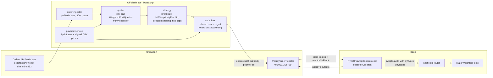

# Ryze UniswapX Filler — Architecture & Implementation Plan

> **Status:** M0–M3 implemented. On-chain executor + tests (M1); bot quoter/strategy/submitter run in **shadow
> mode** (M3). Base deployment wired into `bot/config/base.json` (OQ-4 resolved). Remaining before M4: reconcile
> the payload client wire-format (OQ-1), deploy the executor, owner sign-off. Deploy/go-live: `RUNBOOK.md`. See §7.
> **Owner:** Amit. This doc is the handoff spec — any agent picking up a milestone should read this file, then `/CLAUDE.md` (system guide), then the referenced source files.

---

## 1. Goal

Run a filler that wins **UniswapX Priority Orders on Base** by sourcing liquidity from **Ryze SmartShield pools**, routing external orderflow into Ryze (volume, fees, WBR) while earning filler margin. Secondary goal: the on-chain executor + quoting layer double as the public reference integration for third-party solvers ("how to route through Ryze").

Non-goals (for now): Dutch orders on mainnet/Arbitrum, CoW solver engine (separate project, reuses the payload + quoting layers built here), cross-chain fills.

---

## 2. External protocol facts (verified 2026-07-05)

- **Reactor:** `PriorityOrderReactor` on Base at **`0x000000001Ec5656dcdB24D90DFa42742738De729`**. Same interface as all UniswapX reactors: `execute`, `executeBatch`, `executeWithCallback`, `executeBatchWithCallback`.
- **Auction = priority gas auction.** No Dutch decay. Each order carries a baseline (min) output. For **every wei of tx priority fee above the order's `baselinePriorityFeeWei` threshold, the swapper is owed +1 MPS** (milli-basis-point, 1/1000 bp = 1e-7) more output (exact-input orders) or less input. Highest-priority-fee fill wins; all competing txs **revert on-chain** (reactor reverts early to cheapen losses, but losers still pay gas).
- **Start block:** each order is executable only after its `auctionTargetBlock` (a few blocks after publication). Uniswap Labs may **cosign** to advance the start block — parse as `CosignedPriorityOrder`.
- **Order discovery:** poll `GET https://api.uniswap.org/v2/orders?orderStatus=open&orderType=Priority&chainId=8453`, or register a **webhook** with Uniswap Labs (lower latency; do this once the bot is stable). Parse with `@uniswap/uniswapx-sdk` **≥ 2.1.0-beta.13** (`CosignedPriorityOrder.parse(serialized, chainId)`).
- **Callback fill flow (`executeWithCallback`):**
  1. Reactor pulls the swapper's input tokens via Permit2 and transfers them to the executor contract.
  2. Reactor calls `reactorCallback(ResolvedOrder[] orders, bytes callbackData)` on the executor.
  3. Executor must end the callback holding the resolved output amounts **approved to the reactor**.
  4. Reactor transfers outputs to the order recipients. Everything atomic — any shortfall reverts.
- Filling is **permissionless**: no KYC, no bond, no whitelist on the UniswapX side.

Docs: [PriorityOrderReactor](https://docs.uniswap.org/contracts/uniswapx/fillers/priority/priorityorderreactor) · [Filler integration](https://docs.uniswap.org/contracts/uniswapx/guides/createfiller) · [UniswapX repo](https://github.com/Uniswap/UniswapX) (reference `SwapRouter02Executor`).

---

## 3. Ryze-side facts (verified against this repo)

- Swaps go through `src/amm/MultiHopRouter.sol` → `swapExactIn(SwapParams)` / `swapExactOut`. **Permissionless** unless `pauseDirectSwap` is set, in which case caller must be in `isWhitelistedIntentSwapper` (owner-settable — whitelist the executor regardless, so a future pause doesn't kill the filler).
- Router `safeTransferFrom(msg.sender)`s the input → executor must **approve the router** for input tokens.
- **Caller-supplied prices:** every swap must include fresh `pythUpdateData` (Pyth Lazer payloads) + `cexPriceData` (signed CEX prices); router runs `_updateAndVerifyPrices` in the same tx. Stale/absent payloads ⇒ revert. This is the core integration burden — see §5.3.
- **Exact off-chain quotes:** `src/amm/WeightedPoolQueries.sol#querySwapExactIn` returns the full SmartShield quote **including sessionized fees for `msg.sender`'s session** — quote with the executor address as caller (`eth_call` with `from` override) so previews match execution.
- **Sessionization applies to the executor.** TSP session key = (trader, pool); trader = router's `msg.sender` = the executor. Repeated same-direction fills through one pool accumulate sessionized slippage/WBF. Netting (opposite-direction flow), EMA decay, and `tMax`/`bMax` resets bound it. **Decision: do NOT exempt the executor** — rely on netting/decay, and let the bot's quoter price it in (it does automatically, since `querySwapExactIn` is session-aware).
- **WBF/WBR asymmetry:** improving-direction fills get fee suppression + possible WBR (paid in output token from treasury) ⇒ bot should bid more aggressively on improving flow. `amountOut + wbrFee >= minAmountOut` is the router-side check.

---

## 4. System overview



Fill tx lifecycle: bot sees order → quotes Ryze net-out → if `ryzeOut > orderOutAt(bid) + gas + margin`, submits `executor.execute(order, fillData)` with chosen `maxPriorityFeePerGas` → reactor pulls swapper input to executor → callback swaps through Ryze (fresh price payloads embedded in `fillData`) → outputs approved back to reactor → reactor pays swapper. Win = spread kept by executor; lose = revert (gas cost only).

---

## 5. Components

### 5.1 On-chain: `RyzeUniswapXExecutor.sol`

**Location:** `src/RyzeUniswapXExecutor.sol` in this standalone repo (Foundry, solc 0.8.30 / via-ir; `forge-std` + `openzeppelin-contracts` submodules). Tests in `test/`. Decoupled from the Ryze source tree via the minimal `IRyzeRouter` interface (field-compatible with the deployed `MultiHopRouter`), so the project builds without ryze-contracts checked out.

Responsibilities:
- `execute(SignedOrder calldata order, bytes calldata fillData)` — `onlyOperator` entrypoint → `reactor.executeWithCallback(order, fillData)`.
- `reactorCallback(ResolvedOrder[] calldata, bytes calldata fillData)` — `onlyReactor`. Decode `fillData` = `(Hop[] path, uint256 minAmountOut, uint256 deadline, bytes[] pythUpdateData, IOracle.CexPriceData[] cexPriceData)`; approve router for input; call `MultiHopRouter.swapExactIn` (recipient = executor); make resolved outputs available to reactor. **ERC20 outputs:** approve the reactor — its `_fill` pulls each via `transferFrom(executor, recipient)` (source-verified). **Native-ETH outputs:** the sentinel is `address(0)` (NOT `0xeeee…`); the reactor pays the recipient from its **own** balance via `.call`, so the executor must **send ETH to the reactor** during the callback — unwrap the WETH the swap delivered (`weth.withdraw`) and forward it. Leftover output above what the order owes is the filler's spread.
- Admin (Owned): `setOperator`, `sweep` (tokens + ETH, to owner), `approveRouter(token)`, `receive()`.
- Keep it dumb: **no pricing logic on-chain.** All economics decided off-chain; the router's `minAmountOut` + reactor's output check are the safety rails.

Vendored interfaces (`src/interfaces/`): `IReactor`, `IReactorCallback`, `ReactorStructs` (`ResolvedOrder`/`SignedOrder`/…), `IWETH`, and `IRyzeRouter`.

### 5.2 Off-chain bot (`uniswapx-filler/bot/`, TypeScript)

Modules (keep them separate files/services — the quoter and payload-service get reused by the future CoW engine):

| Module | Responsibility |
|---|---|
| `order-ingestor` | Poll orders API every ~1s (webhook later). Filter: chainId 8453, tokens with a Ryze pool path, size within band limits. Track order lifecycle to avoid duplicate bids. |
| `payload-service` | Maintain hot cache of latest Pyth Lazer payloads + signed CEX prices for all Ryze pool assets (same feed pipeline production uses — **reference client: `limit-order-bot/` (Go, in this repo): `internal/oracle/cex_oracle.go` (signed-CEX WS), `internal/oracle/pyth_price.go` (Pyth Lazer WS), `internal/executor/executor_amm.go` (fill assembly); also `../ryze-router`**). Expose `getPayloads(assets[]) → {pythUpdateData, cexPriceData, prices: TokenPrice[]}` with freshness timestamps. |
| `quoter` | Best Ryze path (single/multi-hop over configured pools) via `querySwapExactIn` `eth_call` with `from = executor`. Returns net out incl. sessionized fees + WBR. |
| `strategy` | Profit: `profit(bid) = ryzeNetOut − orderOutput(bid) − gasCost(bid)` where `orderOutput(bid) = baselineOut × (1 + mps(bid)/1e7)`, `mps(bid) = max(0, bid − baselinePriorityFeeWei)`. Pick bid targeting configured margin (start: capture ~50–80% of observed spread; tune from win/loss data). Shade up on improving-direction fills (WBR/fee suppression), down on worsening (WBF). Enforce caps: max notional/fill, max open exposure/token, max reverted-gas spend/hour, payload max-age. |
| `submitter` | Build `executor.execute` tx with `maxPriorityFeePerGas = bid`, fresh payloads fetched at send time, `deadline` = now + small buffer. Target `auctionTargetBlock` (cosigned earlier start if present). Track win/revert outcomes + P&L per fill. |
| `metrics` | Prometheus-style counters: orders seen/quoted/bid/won/reverted, spread captured, gas burned on losses, payload staleness, session state per pool. |

### 5.3 Price payload pipeline (critical path)

The whole filler lives or dies on payload freshness: the quote is only executable while the Pyth Lazer payload and CEX signatures the tx carries pass `PythProOracle` verification (tolerance/staleness checks — see `src/oracle/PythProOracle.sol`). Rules:
- Fetch payloads **immediately before send**, not at quote time; re-quote if price moved > threshold.
- If the signed-CEX feed is operated by us (check oracle config for the authorized CEX signer), the bot needs access to that signing service or its output stream — **open question OQ-1 below.**
- Store per-asset feed IDs/config in one place: `bot/config/base.json` (pools, assets, feed IDs, reactor + router + executor addresses, band limits).

---

## 6. Economics & risk

- **Losing bids revert but cost gas.** Base gas is cheap but nonzero; the early-revert in the reactor caps it. Budget reverted gas as customer acquisition; alert if losses/hour exceed cap.
- **No inventory risk in steady state** — input arrives from the reactor and is swapped atomically within the fill tx. Residual risks: payload staleness reverts, band-edge quotes (`externalLiquidityRatio` shifts with notional), session drift between quote and fill (another of our own fills landing first — serialize fills per pool).
- **Session accumulation** is the main quiet cost: monitor `N_net` per (executor, pool); prefer balanced two-way flow; back off when sessionized fees erode margin (quoter handles this automatically, strategy should log it explicitly).
- **MEV:** priority auctions are winner-take-all by fee, no sandwich vector on our fill (atomic, minAmountOut-guarded).

---

## 7. Milestones (agent handoff units)

| # | Deliverable | Definition of done |
|---|---|---|
| **M0** | Scaffolding | `src/filler/` + `test/filler/` + `uniswapx-filler/bot/` skeleton compile/lint in CI; UniswapX interfaces vendored; addresses/config file committed. |
| **M1** | `RyzeUniswapXExecutor` + fork tests | Foundry **Base fork test**: construct a signed PriorityOrder (Permit2 + order EIP-712 via `vm.sign`), execute against real reactor address with a mocked/forked Ryze pool + oracle payload stub; asserts swapper receives resolved output, executor keeps spread, native-output path covered. |
| **M2** | Quoter + payload-service | Bot quotes live Base orders (dry-run), logs would-be P&L incl. sessionized fees; payload cache hit-rate + staleness metrics. |
| **M3** | Strategy + submitter, **shadow mode** | Full loop running, computing bids, NOT sending txs; 1 week of shadow P&L logs reviewed. |
| **M4** | Live, capped | Whitelist/approve executor on router (owner op), caps at small notional; first won fill on Base verified end-to-end; runbook written. |
| **M5** | Hardening | Webhook feed, alerting, per-pool serialization, bid tuning from win/loss data; publish third-party "route through Ryze" integration doc extracted from this code. |

Rule for agents: milestones are sequential; do not start M4 without explicit owner sign-off (it moves real funds and requires the owner key for whitelisting).

## 8. Open questions (resolve before M2/M4)

- **OQ-1 (partially resolved):** Signed CEX prices come from `us1.mainnet.pricing.ryze.pro`; Pyth Lazer via the Pro
  websocket stream (token held out-of-band). Endpoints wired (`bot/src/env.ts` + `payloads/source.ts`). **Remaining:**
  reconcile the websocket subscribe + signed-CEX response mapping against the `limit-order-bot` reference (`RECONCILE`
  markers in `source.ts`) before trusting live prices.
- **OQ-2:** Is `pauseDirectSwap` expected to be enabled on Base? If yes, executor whitelisting becomes a hard M4 dependency. (Whitelist authority = Ryze pool owner `0x0A2C…`.)
- **OQ-3:** `intentFee` lane vs direct swap — direct `swapExactIn` avoids the intent fee; confirm no plan to restrict direct swaps to the intent lane.
- **OQ-4 (resolved):** Ryze is live on Base — first pairs are **WETH-USDC** and **WBTC-USDC** (addresses in `bot/config/base.json`). Confirm typical order flow/sizes against these during M3 shadow.
- **OQ-5:** Ryze quotes vs order sizes — verify typical UniswapX Base order notionals sit inside band-1 external liquidity ratios; otherwise quoting degrades exactly where flow is. (Per-pool `bandLimits.maxNotionalUsdWad` set to a 25k placeholder — tune from shadow data.)

## 9. Repo layout

Standalone repo (`github.com/amityadav0/filler`):

```
filler/
  ARCHITECTURE.md        ← this file
  README.md
  foundry.toml, remappings.txt
  .github/workflows/ci.yml   ← forge build/test + bot typecheck
  lib/                   ← forge-std, openzeppelin-contracts (submodules)
  src/
    RyzeUniswapXExecutor.sol
    interfaces/          ← IReactor, IReactorCallback, ReactorStructs, IWETH, IRyzeRouter
  test/
    RyzeUniswapXExecutor.t.sol   ← unit tests (+ guarded Base fork check)
    mocks/               ← MockReactor, MockRyzeRouter, MockWETH, MockERC20
  bot/                   ← TypeScript service (M2+): src/{ingestor,quoter,strategy,payloads,submitter,metrics}/
    config/base.json     ← addresses, pools, feeds, caps
```

## 10. Key references

| Thing | Where |
|---|---|
| Reactor (Base) | `0x000000001Ec5656dcdB24D90DFa42742738De729` |
| Orders API | `https://api.uniswap.org/v2/orders?orderStatus=open&orderType=Priority&chainId=8453` |
| SDK | `@uniswap/uniswapx-sdk` ≥ 2.1.0-beta.13 (`CosignedPriorityOrder`) |
| Reference executor | `SwapRouter02Executor` in github.com/Uniswap/UniswapX |
| Ryze swap entry | `src/amm/MultiHopRouter.sol` (`swapExactIn`, `_updateAndVerifyPrices`, whitelist) |
| Quotes | `src/amm/WeightedPoolQueries.sol#querySwapExactIn` (session-aware; call with `from=executor`) |
| Oracle verification | `src/oracle/PythProOracle.sol` |
| Sessionization rules | `src/amm/TradeSlicingProtection.sol` + `/CLAUDE.md` §Sessionization |
| Background research | `docs/research-solver-networks-near-1click-1inch.md` §6 |
